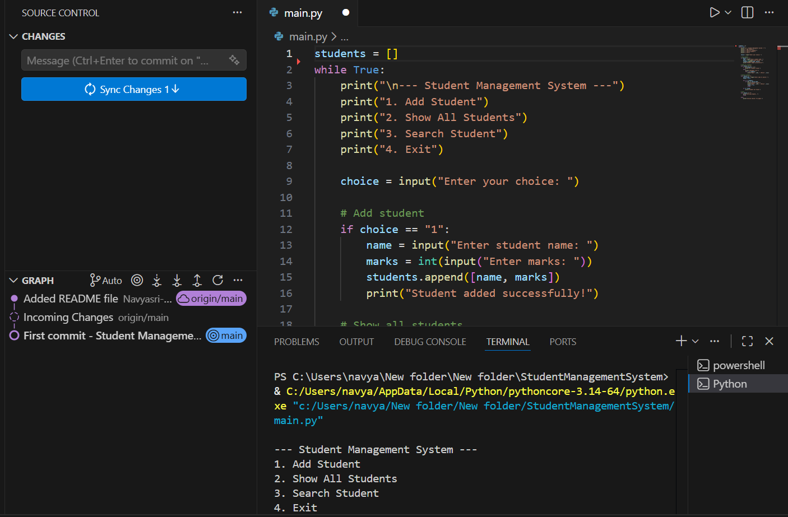

# Student Management System

A simple Python mini project to manage student records.

## Features
- Add student
- Show all students
- Search student
- Menu-based system

## Technologies Used
- Python
- VS Code
- Git & GitHub

## How to Run

```bash
python main.py
## Project Screenshot


